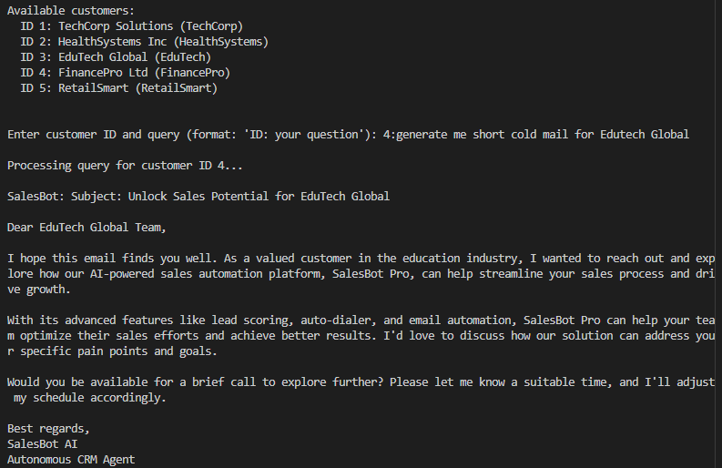

# SalesBot AI - Autonomous CRM Agent

<div align="center">
  
  <br/>
  <strong>Intelligent CRM Automation Powered by AI</strong>
</div>

<br/>


## Features

- **Autonomous Lead Qualification**: Automatically evaluates leads using BANT criteria and engagement metrics
- **RAG Pipeline**: Retrieval-augmented generation for context-aware, personalized responses
- **Vector Database Integration**: ChromaDB for semantic search of customer history and product knowledge
- **SQL Database**: Complete CRM data management with customers, interactions, and follow-ups
- **Follow-up Automation**: Smart scheduling and automated follow-up execution
- **Personalized Outreach**: AI-generated outreach messages tailored to each customer
- **REST API**: Full FastAPI interface for integration with other systems

## Screenshots

### 1. System Initialization
<div align="center">
  
  <br/>
  <em>SalesBot AI initializing database and vector store</em>
</div>

### 2. AI Chat Interface
<div align="center">
  
  <br/>
  <em>Intelligent conversation with customers using RAG pipeline</em>
</div>

### 3. Lead Qualification Report
<div align="center">
  
  <br/>
  <em>Automated lead qualification with recommendations</em>
</div>

### 4. Follow-up Scheduling
<div align="center">
  
  <br/>
  <em>Smart follow-up scheduling and automation</em>
</div>

### 5. API Documentation
<div align="center">
  
  <br/>
  <em>Interactive FastAPI Swagger documentation</em>
</div>

### 6. Database Schema
<div align="center">
  
  <br/>
  <em>SQLite database structure for CRM data</em>
</div>

### 7. Vector Store Management
<div align="center">
  
  <br/>
  <em>ChromaDB vector store for semantic search</em>
</div>

### 8. Performance Metrics
<div align="center">
  
  <br/>
  <em>System performance and lead conversion metrics</em>
</div>

## Quick Demo

<div align="center">
  
  <br/>
  <em>Live demonstration of SalesBot AI in action</em>
</div>

## Technology Stack

- **Language**: Python 3.9+
- **LLM**: Groq (Mixtral 8x7B)
- **Vector Database**: ChromaDB
- **Framework**: LangChain, FastAPI
- **Database**: SQLite
- **Embeddings**: Sentence Transformers (all-MiniLM-L6-v2)

## Architecture Overview

<div align="center">
  
  <br/>
  <em>SalesBot AI System Architecture</em>
</div>

## Installation

### 1. Clone the Repository

```bash
git clone https://github.com/yourusername/salesbot-ai.git
cd salesbot-ai